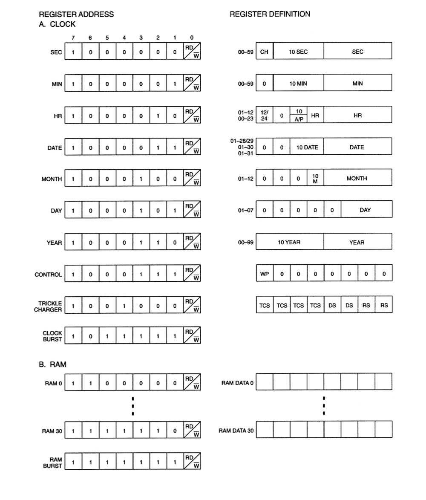
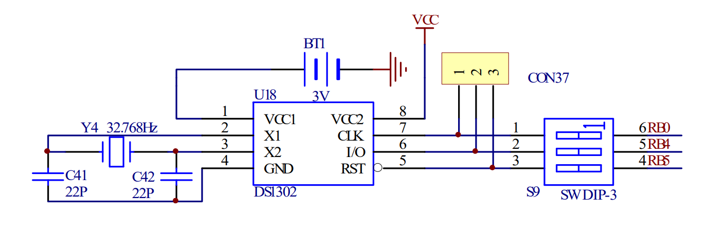

# Timing Chip (DS1302)

##Description
This chip provides a capability to read and write a time and then have it tracked by the chip internally when operating a system, in this case the PIC.

##Features
* Serial interface (read one bit at a time I/O Pin)
* 3 pins (RST->Reset, I/O->Read/Write, SCLK->Serial Clock)

##Writing & Reading Options
The data within the chip is stored in register which each contain different peices of data see the table below for the register addresses and storage mappings:

Source: DS1302 Trickle Charge Timekeeping Chip Datasheet

When writing or reading this can be done on a single register or done using a burst mechnism which is supported by the timing chip.

###Burst Mechanism
The burst which is initiated by sending the burst command will tell the chip to read all the memory location starting at (seconds) and working its way down to (year) this will send each register bit by bit.

This means that the handling code will have to assemble bytes from the bits sent and when it gets a byte move on and start assembling another.

###Writing Commands
The command byte is important to any data transfer as it must first be sent to the chip for both a read and write operation. The diagram below shows the layout of the command byte.

There is important information about each bit within this byte which is detailed below:

* Bit 7 must always be set to logic 1.
* Bit 6 is toggling accesing the clock/calendar data or the RAM inside the chip. [ 1 = RAM, 0 = clock/calendar]
* Bits 1-5 make up the register which is to be read or written to.
* Bit 0 is toggling a read or a write to the register [ 1 = READ, 0 = WRITE]

In order to inititate sending a command the `RST` pin which is on the board must be drove high this is then followed by a command. Once the `RST` pin is drove high and the command has been written for a read the next 8 bits coming down the `I/O` port are the data requested. In the case of a write then 8 bits should be pushed down the `I/0` line. Drive the `RST` pin low to mark the end of a operation.

#Schematic (QL200)
The following schematic shows how the pins are mapped these are detailed below:
* `RST -> RB5`
* `I/O -> RB4`
* `CLK -> RB0`

SOURCE: QL200 User Manual

